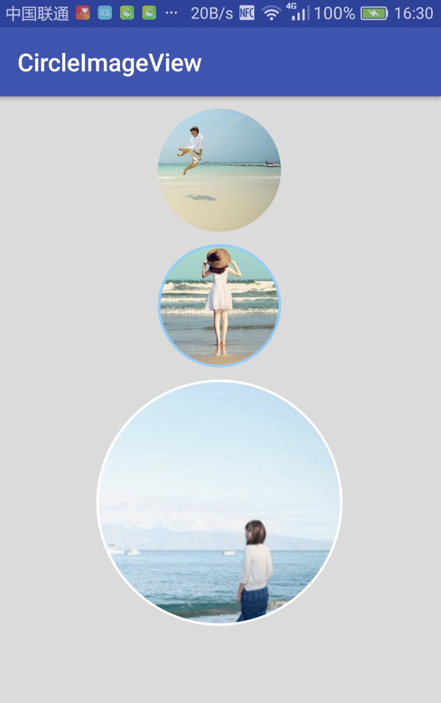

# CircleImageView
a circle imageView for android

## 效果图

## 如果你是androidStudio用户，在Gradle添加

	dependencies {
    ...
    compile 'com.cool:circleimageview:1.0.1'
	}
	
	

## 使用

    <com.cool.library.widget.CircleImageView
        xmlns:me="http://schemas.android.com/apk/res-auto"
        android:layout_width="200dp"
        android:layout_height="200dp"
        android:src="@mipmap/ic_launcher"
        me:borderWidth="2dp"
        me:borderColor="@color/colorAccent"/>
